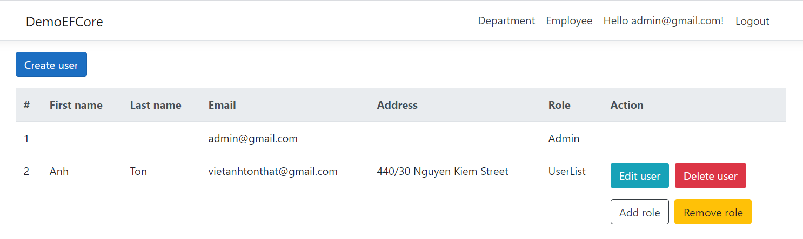
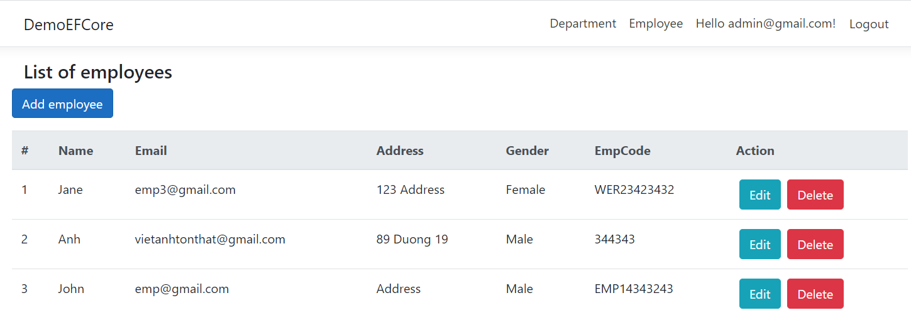
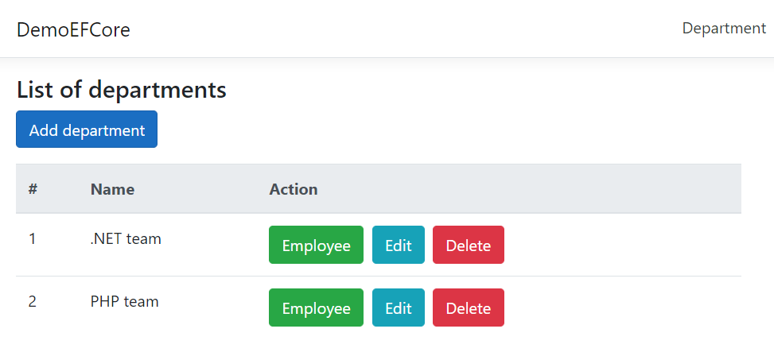
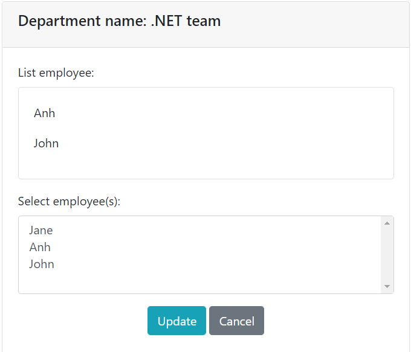

# ASP.NET Core project using Identity and Entity Framework Core
This repository includes: 
- Demo Login and Register using Identity
- Demo CRUD Many-to-many relationship using Entity Framework Core with tables Employee, Department

Screenshot for the project example:
-  User management

-  Employee management

-  Department management

-  Add, update employee into department

## Instruction
-  Login first with email "admin@gmail.com" and password "admin".
-  Then use other functions normally.

## Documentation
The ASP.NET Core project documentation is available here. https://github.com/Aegona-Ltd/apsnetcore-identity
